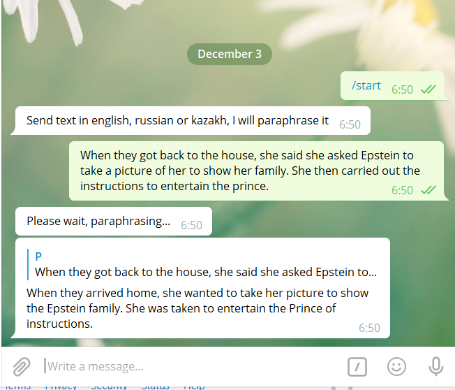

# ParaTextPhraser

This bot paraphrases text in english, russian or kazakh by translating a text to japanese, then to portuguese, then to turkish, then to original language

# Dependencies
```pip install translate-api
pip install pyTelegramBotAPI```

